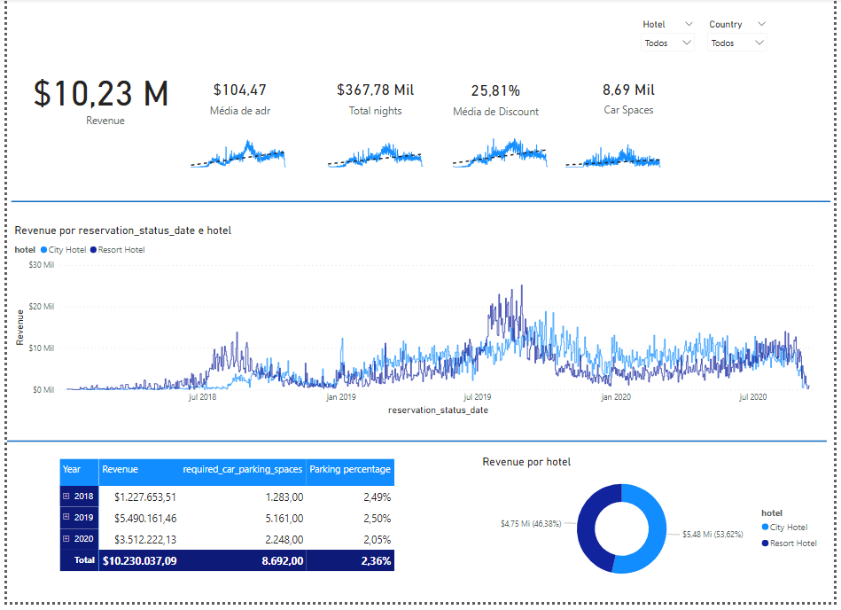

## Hotel-revenue-SQL-Database

This project is my first portfolio data analysis project. 

## Contents
1. [Goal](#goal)
2. [Requirements & tools](#requirements)
3. [Questions asked](#Questions-asked)
4. [Analysis to perform](#Analysis-perform)
5. [Steps taken](#Steps-taken)
6. [Results](#Results)

# Goal
* The focus of this project was to create a database in SQL, by using Excel sheets containing hotel booking data.
* After that the database is linked to a visualization product, a PowerBI dashboard.

# Requirements & tools
* Building a visual data story (dashboard) using PowerBI to present to potential stakeholders.
* Microsoft SQL Server Management Studio 18
* SQL Server 2019
* PowerBI Desktop 

# Questions asked
* "Is our hotel revenue growing by year?"
* "Should we increase our parking lot size?"
* "What trends can we see in the data?"

# Analysis to perform
* Revenue segmentated by hotel type (There are 2: City hotel and Resort hotel)
* Trends in guests with personal cars
* Average daily guests

# Steps taken
1. Building a database
2. Developing the SQL Query
3. Link PowerBI to the database
4. Visualization
5. Summarize findings

# Results 
In the image below, we can see the dashboard designed in PowerBI Desktop. In there, we are able to visualize the numerical results for total revenue from the hotels, that can be selected by year. In addition to that there are the total nights revenue, discount average and car spaces. 

    

In the visual part we have the graphs showing the trends, if revenue is going up or down, if more space for cars is needed, what months in the year more guests book their reservations and so it goes on. These trends can answer the questions asked and much more can be made. For instance, the revenue from 2018 to 2019 increased considerably and so did the required car parking spaces. On the other hand, from 2019 to 2020 there was a decrease in revenue and the parking size required percentage did not oscillate that much, so that we cannot make a solid conclusion wether to build a bigger parking lot for example. 
